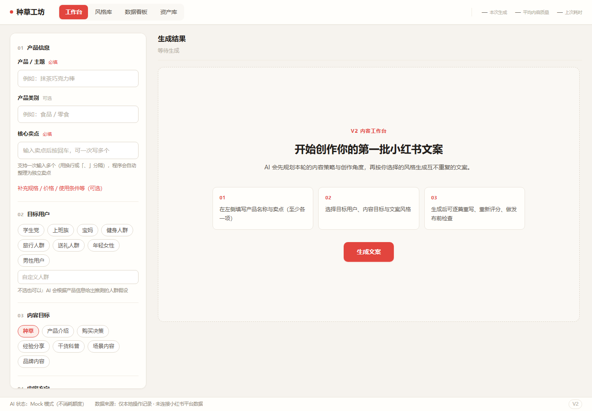
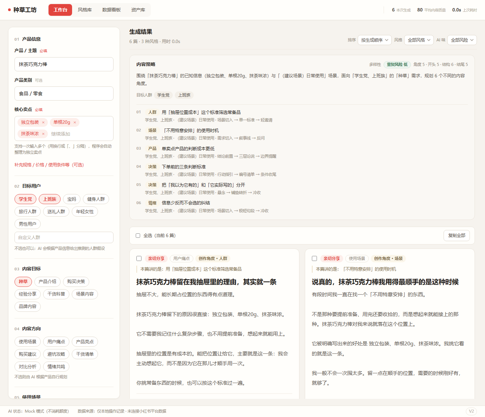
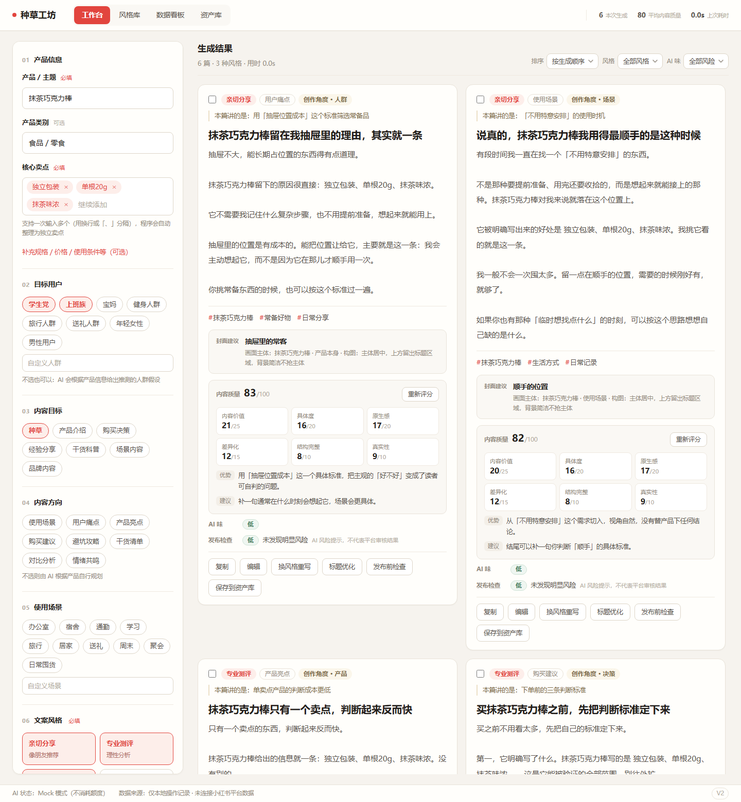
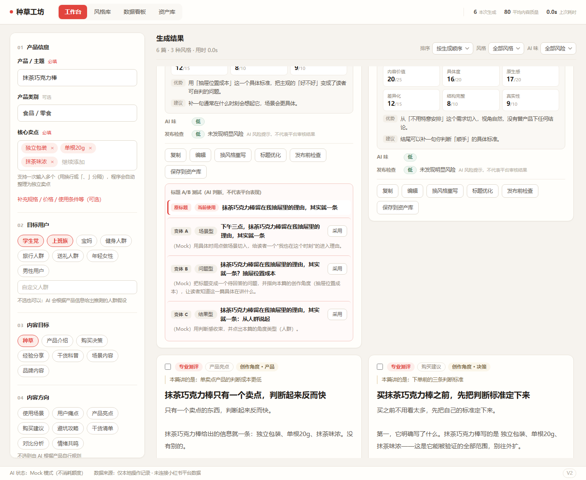
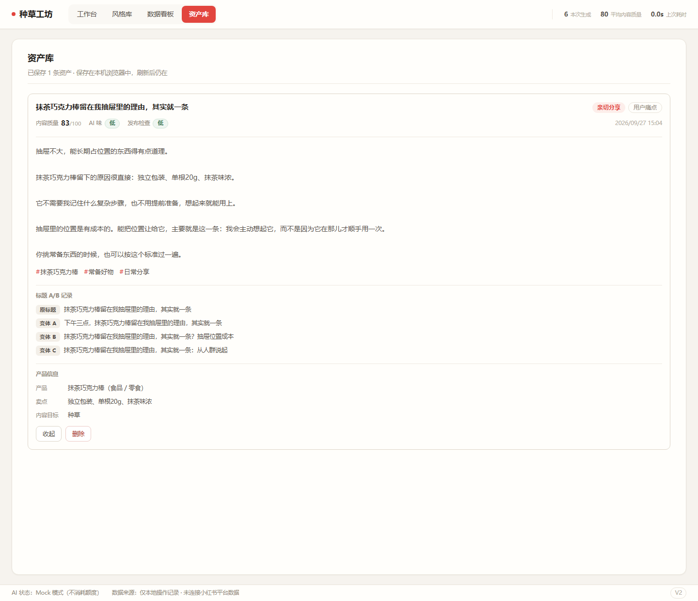
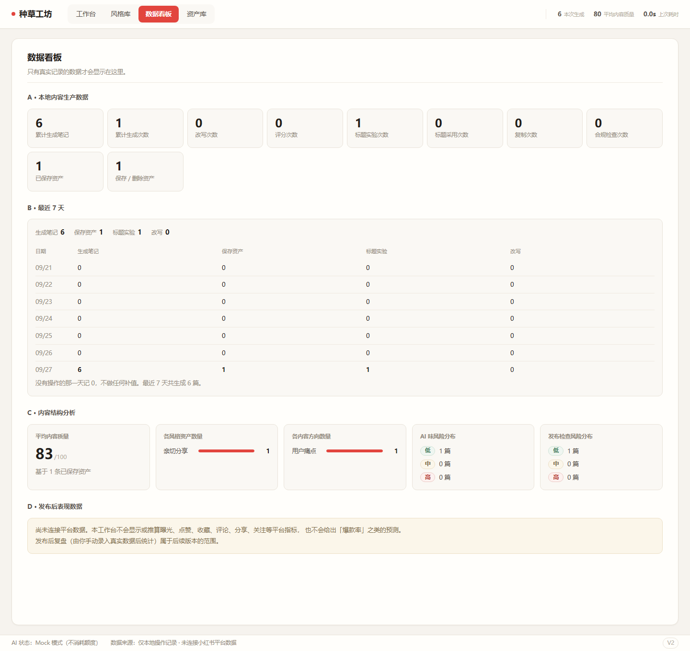

# 小红书 AI 内容工作台（V2）

一个面向小红书内容创作场景的 AI 工作台：输入产品与卖点，批量生成不同风格的种草笔记，并完成内容策略规划、质量检查、修改、标题 A/B 与本地复盘。

区别于"输入一句话输出一篇文案"的生成器，本项目的重点在于**把内容创作拆成可检查、可修改、可对比的流程**，并把"哪些交给 AI、哪些交给程序"作为明确的工程边界。

---

## 一、项目简介

| 项 | 说明 |
|---|---|
| 产品形态 | 单页 Web 工作台（桌面优先），前端 + 后端同仓库 |
| 使用方式 | 本地运行或 Docker 部署，模型凭据由使用者自行提供 |
| 数据存储 | **仅浏览器 localStorage**（资产与操作统计），无数据库、无账号体系 |
| 平台数据 | **未接入**小红书平台数据，不显示也不推算曝光/点赞/收藏等指标 |

## 二、功能列表

### 内容生成

- **批量生成**：一次生成 5 ~ 10 篇，可同时选择多种风格
- **6 种内置风格**：亲切分享 / 专业测评 / 搞笑段子 / 干货攻略 / 情绪共鸣 / 清单种草
- **8 个内容方向**：使用场景 / 用户痛点 / 产品亮点 / 购买建议 / 避坑攻略 / 干货清单 / 对比分析 / 情绪共鸣
- **内容策略**：生成前先规划本轮总策略、目标人群、使用场景，以及**与篇数一一对应的创作角度**
- **多样性报告**：由程序统计开头 / 结构 / 结尾 / 风格 / 角度类型数量，并给出重复风险等级
- **封面创意建议**：每篇给一句封面标题与构图描述（只输出创意，不生成图片）

### 单篇操作

- **就地编辑**：只改本地内容，不调用 AI
- **换风格重写**：指定目标风格重写单篇，保留原文事实
- **重新评分**：六维内容质量评分（内容价值 / 具体度 / 原生感 / 差异化 / 结构完整 / 真实性），总分 100
- **标题 A/B**：为单篇生成 3 个标题变体，与原标题并列对比，可反复切换
- **发布前检查**：对单篇做合规复查，输出风险等级与具体改法
- **复制**：单篇或批量复制，按「标题 + 正文 + #话题标签」格式输出

### 质量检查（生成时自动附带，也可单独触发）

- **AI 味检查**：识别套模板、机械总结、空洞形容词、仅替换产品关键词等风险（独立项，不计入评分）
- **合规检查**：识别绝对化表达、无依据的效果承诺、虚构数据与评价等风险

### 内容管理

- **参考文案分析**：粘贴一篇参考文案，分析其开头方式 / 结构 / 信息密度 / 节奏 / 叙事与语言风格 / 情绪强度 / 结尾 / 互动方式，并给出可借鉴方法与**不应复制的内容类型**
- **资产库**：把满意的笔记存入浏览器本地，支持查看与删除，刷新后仍在
- **数据看板**：展示**真实发生过的操作统计**（生成篇数、改写 / 评分 / 标题实验 / 采用 / 复制 / 合规检查次数）与最近 7 天趋势，以及已保存资产的结构分布

### 明确不包含

登录与账号、多人协作、支付、数据库、实时爬虫、自动发布、图片或视频生成 API、平台数据接入。

## 三、技术架构

```
┌──────────────────────────────────────────────────────────┐
│  浏览器                                                    │
│  React 19 + TypeScript                                    │
│  状态：useReducer + Context（不引入状态库与路由库）             │
│  本地存储：localStorage（资产 / 操作统计，均带 schemaVersion）    │
└───────────────────────────┬──────────────────────────────┘
                            │ HTTP /api/*
┌───────────────────────────▼──────────────────────────────┐
│  Express 5（生产环境同时提供前端静态文件）                       │
│                                                            │
│   routes/     只做编排：校验 → 组装 Prompt → 调用 → 响应        │
│   ai/client   唯一 AI 出口（流式接收后聚合）                    │
│   ai/structured  解析 + Schema 校验 + D8 失败重试             │
└───────────────────────────┬──────────────────────────────┘
                            │
┌───────────────────────────▼──────────────────────────────┐
│  app/prompts/   提示词（**仅后端引用，绝不打包进浏览器**）        │
│  app/shared/    前后端共享契约：类型 / 常量 / 校验规则（唯一来源）  │
└──────────────────────────────────────────────────────────┘
```

### 职责边界

| 交给 AI | 交给程序 |
|---|---|
| 语义理解、内容策略、创作角度、文案撰写、自检与质量判断 | 输入校验、篇数与风格分配、ID 生成、多样性统计、评分数值合法性、Schema 校验、排序筛选、本地存储、错误处理 |

### 技术选型

| 层 | 选型 | 说明 |
|---|---|---|
| 前端 | React 19 + TypeScript + Vite | 无 UI 框架，样式为原生 CSS + 设计令牌 |
| 后端 | Express 5 + `@anthropic-ai/sdk` | 无 ORM、无数据库 |
| 共享层 | `app/shared` | 前后端引用同一份类型与校验实现，避免两侧规则漂移 |
| 部署 | 单进程 Node + Docker | 生产环境由 Express 同时提供前端与 API，无需额外的 Nginx 或第二个端口 |

> 模型服务通过 `ANTHROPIC_BASE_URL` 配置为 Anthropic 兼容端点（本项目在 DeepSeek 上完成真实调用验证）。

## 四、核心亮点

以下都是代码中实际存在、可用文件定位的设计：

**1. 单一事实来源，杜绝前后端规则漂移**
`app/shared` 集中定义类型、常量与校验规则，前端提交前的预校验与后端收到的权威校验**调用同一份实现**（`validateGenerateInput` 等）。枚举变化会直接编译失败，而不是静默不一致。

**2. 一次生成 = 一次 AI 请求**
`/api/generate` 在**同一个响应**里返回内容策略、N 篇正文、评分、AI 味自检、合规自检与封面建议 —— 而不是每篇一次调用或每项检查一次调用。这是明确的成本与延迟约束。

**3. D8 结构化失败重试**
AI 输出会经过「剥离代码块 → JSON 解析 → Schema 校验 → 风格分配比对」，任何一步失败都会把**具体原因反馈给模型**并要求重试，最多一次。重试额度用尽后如实报错，不伪装成成功。

**4. Mock 模式与真实链路共用同一套校验**
开发用的 Mock 数据不是随便造的假响应：它同样要经过 `app/shared` 的校验器，结构标注为共享类型，契约一变就编译失败。Mock 永不进入生产路径（由显式环境变量开启）。

**5. 语义级事实边界**
提示词层对"不得编造"的定义不停留在关键词黑名单，而是按语义分类约束：感官事实、成分与物理特性、个人体验、第三方转述、以品类常识冒充产品事实。信息不足时**允许写短**，禁止用编造内容把篇幅补满。

**6. 不伪造任何平台数据**
数据看板只展示真实发生过的操作记录，无数据时显示 0 或空状态；界面明确标注「尚未连接平台数据」，不显示也不推算曝光、点赞、收藏、涨粉，不出现"爆款率"之类措辞。

**7. 流式接收以突破 SDK 输出上限**
内容策略 + 6 篇正文 + 全套自检的输出体量超过了 SDK 对非流式请求的上限（`max_tokens` 过大时 SDK 直接拒绝）。`ai/client.ts` 改用流式接收后聚合，对上层与前端行为完全不变（仍然是一次请求、一个完整响应）。

## 五、本地运行方式

### 环境要求

- **Node.js >= 22.9.0**（见 `package.json` 的 `engines`）
- npm（随 Node 提供）

### 步骤

```bash
# 1. 安装依赖
npm install

# 2. 配置模型凭据（可选：不配置也能用 Mock 模式查看界面）
cp .env.example .env
#    然后编辑 .env，填入 ANTHROPIC_AUTH_TOKEN / ANTHROPIC_BASE_URL / ANTHROPIC_MODEL

# 3. 启动开发环境（前端 :5173 + 后端 :3001，并行）
npm run dev
```

打开 <http://localhost:5173>。

### 没有模型凭据时

用 Mock 模式查看完整界面，**不消耗任何 AI 额度**：

```bash
VITE_USE_MOCK_DATA=true npm run dev:web
```

Mock 模式下所有数据由本地确定性逻辑生成（与输入相关，不是固定模板）。页面底部状态栏会显示当前处于「Mock 模式」还是「真实 AI」。

> `VITE_USE_MOCK_DATA` 由 Vite 在**启动时**注入，修改后必须重启 dev server。

### 本地生产构建

```bash
npm run build     # 前端 vite build + 后端 tsc
npm start         # node dist/server/index.js
```

访问 <http://localhost:3001>（此时前端与 API 由同一个 Express 进程提供）。

### 常用脚本

| 命令 | 说明 |
|---|---|
| `npm run dev` | 并行启动前端与后端 |
| `npm run dev:web` / `npm run dev:api` | 单独启动前端 / 后端 |
| `npm run build` | 生产构建（前端 + 后端） |
| `npm start` | 生产模式运行（需先 build） |
| `npm run typecheck` | 类型检查（前后端两个 project） |

## 六、Docker 部署方式

### 构建镜像

```bash
docker build -t xhs-copy-studio .
```

多阶段构建：构建阶段装全部依赖并编译，运行阶段只保留生产依赖与 `dist/`，以非 root 用户运行。`.dockerignore` 排除了 `.env*`、`node_modules`、`dist`、`.git` 与文档 —— **凭据不会进入镜像层**。

### 启动容器

推荐用 `--env-file` 传凭据，避免进入 shell 历史：

```bash
# 在服务器上创建（不要提交进 Git）
cat > .env.production <<'EOF'
ANTHROPIC_AUTH_TOKEN=...
ANTHROPIC_BASE_URL=...
ANTHROPIC_MODEL=...
EOF

docker run -d \
  --name xhs-copy-studio \
  -p 3001:3001 \
  --env-file .env.production \
  xhs-copy-studio
```

也可以直接传环境变量：

```bash
docker run -d --name xhs-copy-studio -p 3001:3001 \
  -e ANTHROPIC_AUTH_TOKEN=... \
  -e ANTHROPIC_BASE_URL=... \
  -e ANTHROPIC_MODEL=... \
  xhs-copy-studio
```

访问 <http://localhost:3001>（或 `http://<服务器 IP>:3001`）。

### 容器管理

```bash
docker logs -f xhs-copy-studio     # 查看日志（生成失败原因会打印在这里）
docker stop xhs-copy-studio        # 停止
docker start xhs-copy-studio       # 再次启动
docker rm -f xhs-copy-studio       # 停止并删除容器
```

### 云服务器部署（Ubuntu 示例）

```bash
# ① 安装 Node 22
curl -fsSL https://deb.nodesource.com/setup_22.x | sudo -E bash -
sudo apt-get install -y nodejs

# ② 放置代码到 /opt/xhs-copy-studio，然后安装依赖并构建
cd /opt/xhs-copy-studio
npm ci
npm run build

# ③ 配置环境变量（不要提交进 Git）
#    同上 .env.production

# ④ 用 systemd 常驻
sudo tee /etc/systemd/system/xhs.service > /dev/null <<'EOF'
[Unit]
Description=XHS Copy Studio
After=network.target

[Service]
WorkingDirectory=/opt/xhs-copy-studio
EnvironmentFile=/opt/xhs-copy-studio/.env.production
ExecStart=/usr/bin/node dist/server/index.js
Restart=always
User=www-data

[Install]
WantedBy=multi-user.target
EOF
sudo systemctl enable --now xhs

# ⑤ 放行端口（或改用反向代理走 80/443）
sudo ufw allow 3001/tcp
```

**HTTPS**：将 Nginx 或 Caddy 放在前面反代到 `127.0.0.1:3001`，由它们申请与续期证书。Caddy 最简配置：

```
你的域名 {
    reverse_proxy 127.0.0.1:3001
}
```

## 七、环境变量说明

| 变量 | 作用域 | 必填 | 默认值 | 说明 |
|---|---|---|---|---|
| `ANTHROPIC_AUTH_TOKEN` | 后端 | 是 | 无 | 模型服务凭据（Bearer Token）。**绝不提交进 Git，绝不写入镜像** |
| `ANTHROPIC_BASE_URL` | 后端 | 否 | Anthropic 官方地址 | Anthropic 兼容端点的基础地址 |
| `ANTHROPIC_MODEL` | 后端 | 是 | 无 | 模型名称，由所选服务决定 |
| `PORT` | 后端 | 否 | `3001` | Express 监听端口 |
| `VITE_USE_MOCK_DATA` | 前端（构建期） | 否 | 关闭 | 仅认显式值 `true`；开启后前端走本地 Mock，不发请求 |

配置方式：

- **本地**：复制 `.env.example` 为 `.env` 填入（已被 `.gitignore` 排除）
- **Docker**：通过 `--env-file` 或 `-e` 传入
- **云服务器**：用 systemd 的 `EnvironmentFile` 指向 `.env.production`

启动时缺少 `ANTHROPIC_AUTH_TOKEN` 或 `ANTHROPIC_MODEL`，服务仍会启动，但生成请求会返回明确的配置错误（而不是静默失败）。

## 八、界面截图

截图存放在 [`docs/screenshots/`](docs/screenshots/)，均在 **Mock 模式**下生成（不消耗 AI 额度）。

### 工作台首屏

左侧为配置栏（产品信息 / 目标用户 / 内容目标 / 内容方向 / 使用场景 / 文案风格 / 生成数量），右侧是尚未生成时的空状态与操作指引。



### 生成结果

生成后先呈现本轮内容策略、与篇数一一对应的创作角度，以及程序计算的多样性报告；下方是卡片列表。



### 单篇卡片

卡片的信息层级：`风格 / 方向 / 创作角度` → `标题` → `正文` → `话题标签` → `封面建议` → `六维评分` → `AI 味 / 发布检查` → `操作区`。



### 标题 A/B

原标题与三个变体并列对比，当前使用的那一项有独立标记；采用后列表不消失，可反复切换。



### 资产库

保存到本地的笔记，支持展开查看正文、标题 A/B 记录与产品信息。



### 数据看板

核心指标、最近 7 天趋势与内容结构分析（全部来自真实操作记录与已保存资产，无数据时显示 0 或空状态）。



> ⚠️ 以上截图为 **Mock 模式**下的界面：文案由本地确定性逻辑生成，**不是真实模型的输出**。
> 真实 AI 模式下的界面完全一致，仅内容来源不同（页面底部状态栏会显示「真实 AI」而非「Mock 模式」）。
> 截图的具体来源与重现方式见 [`docs/screenshots/README.md`](docs/screenshots/README.md)。

---

## 附录 A：目录结构

```
app/src/       前端（React）
  api/         后端接口封装 + Mock 实现
  components/  工作台组件
  views/       风格库 / 数据看板 / 资产库
  state/       reducer 与状态容器
  lib/         本地存储、复制文本拼装、风格说明
app/server/    后端（Express）
  routes/      接口编排
  ai/          AI 客户端与结构化处理
  http/        统一错误映射
app/shared/    前后端共享：类型 / 常量 / 枚举 / 校验 / 分配与多样性算法
app/prompts/   提示词（仅后端引用）
docs/          产品需求、技术架构、页面结构、V2 决策
```

## 附录 B：安全约定

- `.env` 与任何凭据**绝不进入 Git**（`.gitignore` 覆盖 `.env`、`.env.*`、`*.key`、`*.pem`、`*.p12`）
- 凭据**绝不进入 Docker 镜像**（`.dockerignore` 排除全部 `.env*`）
- `.env.example` 只保留变量名与空占位值
- 错误响应不向前端暴露内部细节：`detail` 仅用于服务端排障，界面只展示固定的用户文案

## 附录 C：常见问题

**启动时报「端口 3001 已被占用」**
说明已有一个后端在运行。先找到并停掉：

```bash
lsof -i :3001                                     # Linux / macOS
Get-NetTCPConnection -LocalPort 3001 -State Listen  # Windows PowerShell
```

**改了代码但行为没变**
`npm run dev:api` 使用 `tsx watch`；在 Windows 上 Ctrl+C 有时会留下孤儿的 watch 进程，它们会在子进程退出后自动重启并抢占端口。确认清理干净：

```powershell
Get-CimInstance Win32_Process -Filter "Name='node.exe'" | Where-Object { $_.CommandLine -like '*tsx*' }
```

**生成失败，界面只显示一句笼统提示**
具体原因（解析失败 / Schema 不符 / 输出截断）会打印在**后端终端**：

```
[generate] 生成失败  type=SCHEMA_FAILED  detail=...  retryReason=...
```

**用编译产物启动时前端 404**
生产模式必须用 `node dist/server/index.js` 启动（静态目录由该文件位置推导为 `dist/web`）。用 tsx 直接跑源码时不存在该目录 —— 开发期前端由 Vite 提供，属预期行为。
